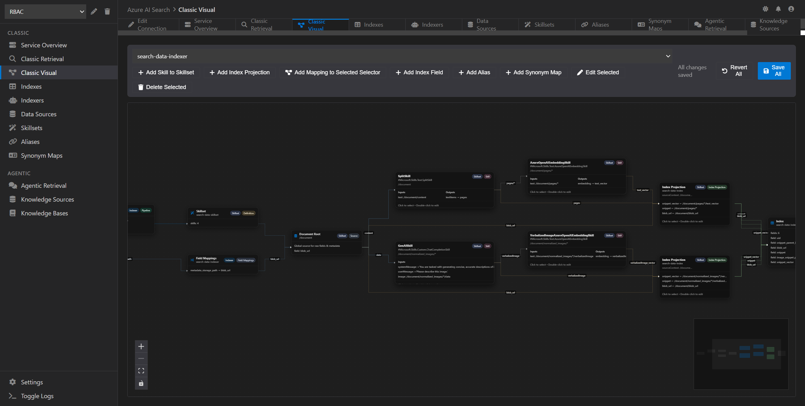

# Azure AI Search Explorer

Azure AI Search Explorer is a desktop UI for exploring, validating, and operating Azure AI Search services, with built-in GitHub Copilot Chat to assist with resource-aware queries. It is designed for day‑to‑day work: inspecting service health, managing indexes and ingestion pipelines, and running both classic and agentic retrieval workflows.

> Azure AI Search is an expensive resource to keep running for development and testing. If this project helps you, please consider sponsoring to offset Azure subscription costs.

## Download

Download the latest production build from the [Releases page](https://github.com/Vijay-Nirmal/AzureAISearchExplorer/releases) and run the installer for your OS.

## Features

https://github.com/user-attachments/assets/80a05da0-7e90-4658-bf20-14b2c88dca11

- **API-first coverage** - If a capability is available via Azure AI Search REST APIs, it is targeted for full support in the app.
- **Connection profiles** - Connect to multiple Azure AI Search services using Entra ID, API Key, or Managed Identity.
- **Service overview** - Review service stats, quotas, and limits at a glance.
- **Classic Retrieval** - Run classic queries and manage documents with upload, edit, delete, reset, and export workflows.
- **Classic Visual** - Visualize indexer pipelines and relationships across data sources, skillsets, indexes, aliases, and synonym maps.
- **Indexes** - Create, update, inspect, and manage index definitions.
- **Indexers** - Configure and manage indexer pipelines.
- **Data Sources** - Create and manage data source connections.
- **Skillsets** - Build and edit skillsets with structured tabs and JSON tooling.
- **Aliases** - Manage alias mappings for index routing.
- **Synonym Maps** - Create and maintain synonym maps for relevance tuning.
- **Agentic Retrieval** - Explore agentic retrieval workflows.
- **Knowledge Sources** - Create and manage agentic knowledge source definitions.
- **Knowledge Bases** - Build and manage knowledge bases for retrieval.

## GitHub Copilot Chat Integration

Azure AI Search Explorer includes a built-in GitHub Copilot Chat panel to help you explore and troubleshoot your search resources.

- **Authentication**: Sign in with GitHub (device code or browser) or use a personal access token.
- **Resource-aware tools**: Read-only tools can fetch indexes, indexers, datasources, skillsets, synonym maps, aliases, knowledge sources, and knowledge bases.
- **Indexer status + service details**: Built-in tools can fetch indexer run status and service overview data.
- **Model picker**: Models are loaded from the Copilot models API with all latest models available.
- **Page Context**: The chat includes the current page context (resource type/name/action) so relative questions like “this” or “here” are understood.
- **Error/Warning assist**: Error and warning toasts include a Copilot button to open chat with a prefilled explanation prompt.

https://github.com/user-attachments/assets/8d31510f-0d31-43a2-ac97-f3ff09c9464a

## Why This App Exists (Even with Azure Portal)

Azure Portal is a great starting point, but it does not expose the full surface area of Azure AI Search. Many capabilities are only available through the APIs, and day‑to‑day operations can feel fragmented. Azure AI Search Explorer was created to fill those gaps and make the service easier to understand and operate.

- **Full API coverage** - Surface features that are not fully available in the portal.
- **Missing portal features** - Manage synonym maps, autocomplete, document upload/download/edit, different data source types, mostly JSON and advanced configurations for each asset type.
- **Clarity for new users** - The Classic Visual experience shows how data sources, indexers, skillsets, and indexes flow together so you can see what is happening at a glance.

## Local Development

If you need to run locally for development:

- Install dependencies: `npm run install:all`
- Start the app: `npm run dev`
